# Metaland Blog

一个基于Go语言开发的博客系统，使用Gin框架和MySQL数据库。

## 运行环境

- Go 1.25+
- MySQL 8.0+

## 依赖安装

1. 克隆项目到本地
```bash
git clone https://github.com/wxq/metaland-blog.git
cd metaland-blog
```

2. 安装项目依赖
```bash
go mod tidy
```

## 数据库配置

1. 创建MySQL数据库
```bash
mysql -u root -p
```

2. 执行数据库脚本
```bash
mysql -u root -p < script/table.sql
```

## 启动方式

1. 生成API文档（可选）
```bash
go generate src/main.go
```

2. 启动服务
```bash
go run src/main.go
```

指定配置文件
```bash
go run src/main.go --conf ./conf/config_prod.yaml
```

## API文档

启动服务后，可以通过以下地址访问API文档：
- Swagger UI: http://localhost:8080/swagger/index.html

## 项目结构

```
metaland-blog/
├── cmd/                    # 命令行工具
├── docs/                   # API文档
├── script/                 # 数据库脚本
├── src/
│   ├── api/               # API接口定义
│   ├── dao/               # 数据访问层
│   ├── db/                # 数据库连接
│   ├── entity/            # 实体类
│   ├── handler/           # 请求处理器
│   ├── middleware/        # 中间件
│   ├── response/          # 响应封装
│   ├── router/            # 路由配置
│   ├── service/           # 业务逻辑层
│   └── utils/             # 工具类
├── go.mod
├── go.sum
└── README.md
```

# 使用外部配置文件
1. 绝对路径
```cmd
bin\metaland-blog.exe --conf D:\conf\config_prod.yaml
```
2. 相对路径
```cmd
bin\metaland-blog.exe --conf ./conf/config_prod.yaml
```

# 测试截图
## 用户管理
1. 注册用户
    ```json
    {
    "password": "123456",
    "userName": "wxq3"
    }
    ```
   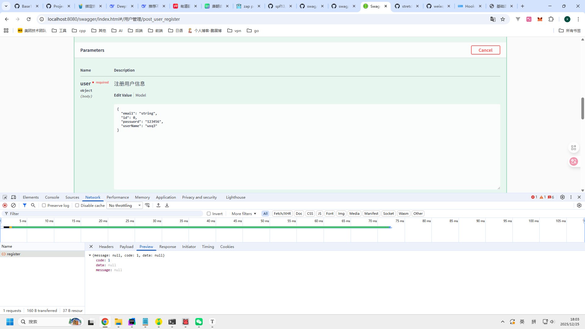
2. 用户登录
   ```json
    {
    "password": "123456",
    "userName": "wxq"
    }
    ```
    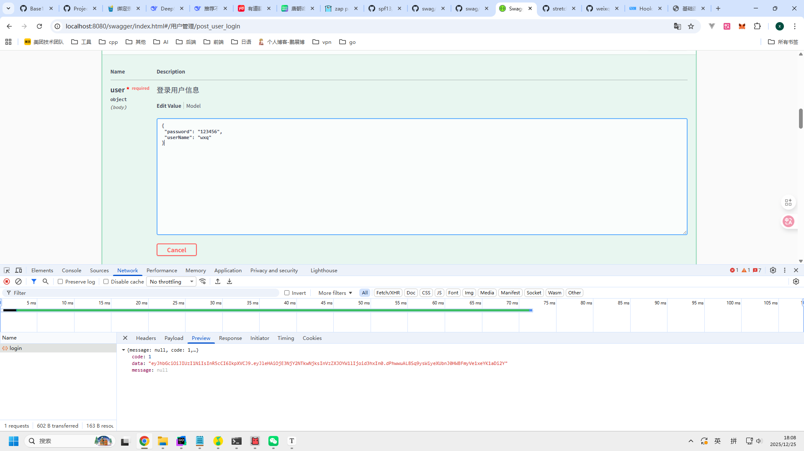
3. 查询当前用户信息
   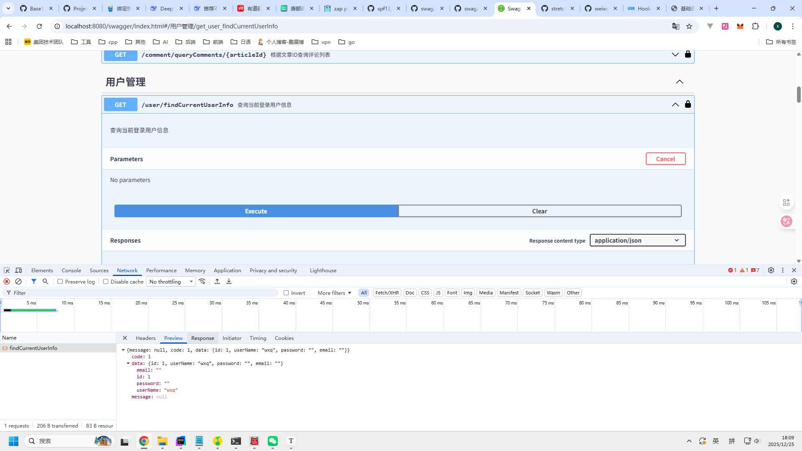
4. 查询指定用户信息
   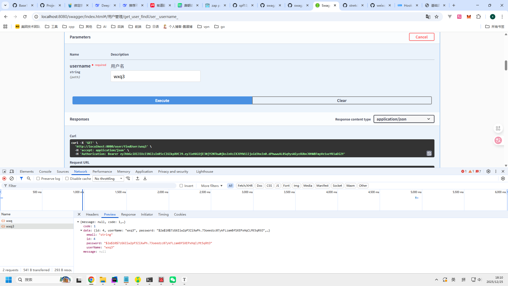

## 文章管理
1. 新增文章成功
    ```json
    {
      "title": "测试新增",
      "content": "新增内容"
    }
    ```
   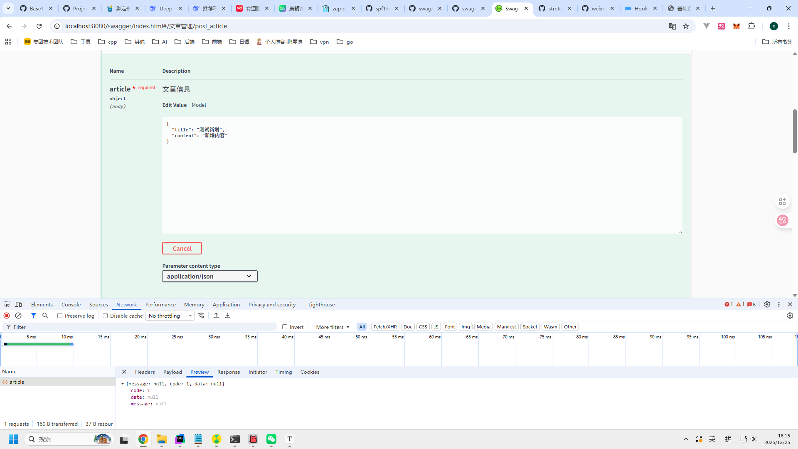
2. 新增文章失败
    ```json
    {
    "title": "测试新增",
    "content": "新增内容",
    "updateTime": "string"
    }
    ```
   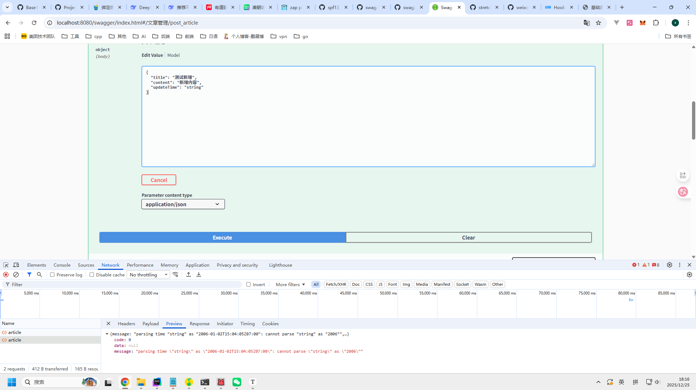
2. 修改文章
    ```json
    {
    "content": "修改内容",
    "id": 2,
    "title": "测试修改"
    }
    ```
   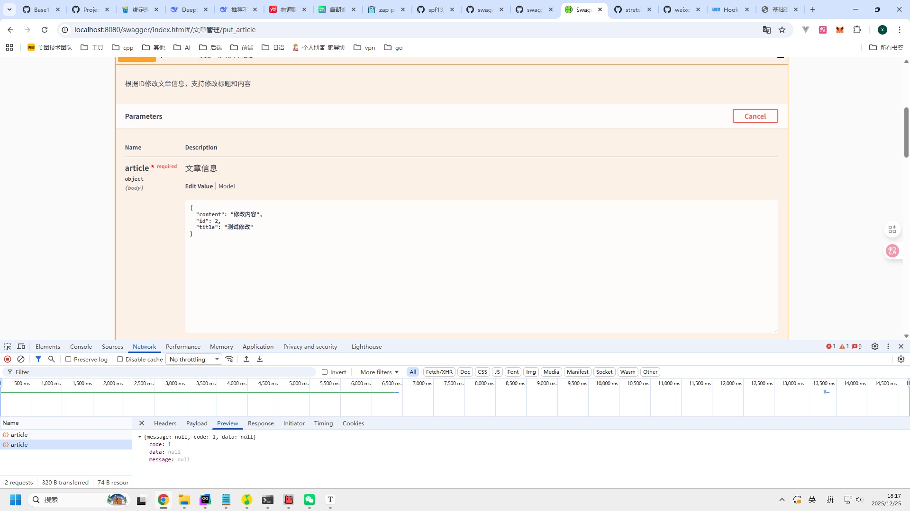
3. 删除文章
   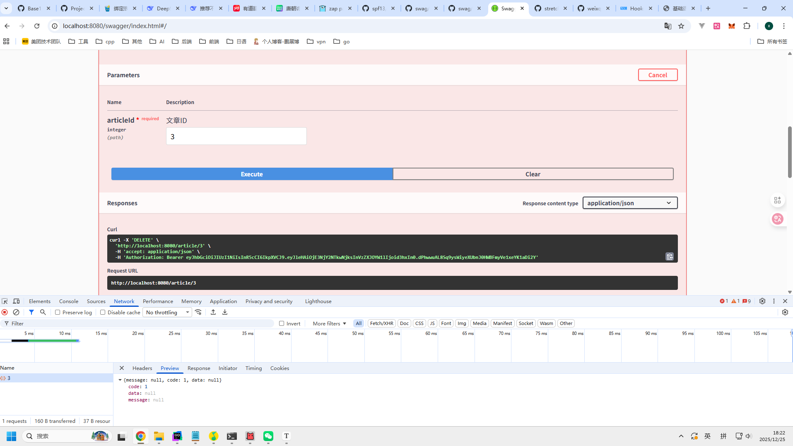
4. 根据ID查询文章信息
   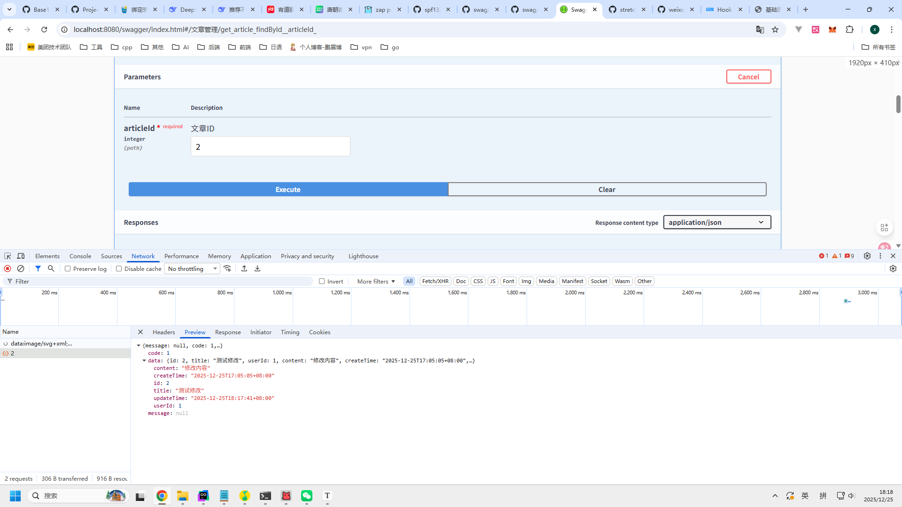
5. 分页查询所有文章
   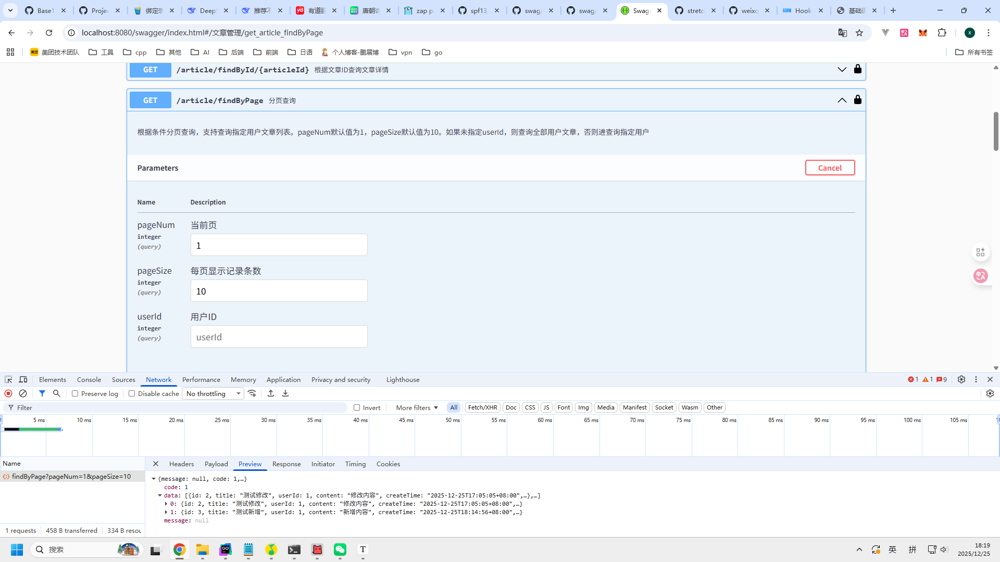
6. 分页查询指定用户文章
   
7. 分页查询文章（无结果）
   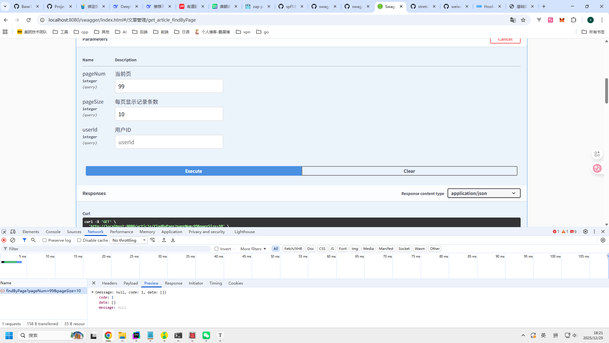

## 评论管理
1. 新增评论
   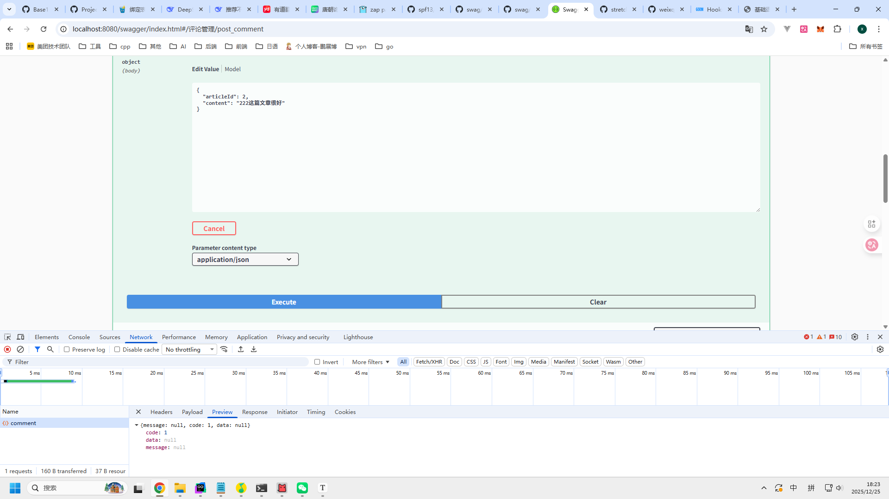
2. 查询文章评论
   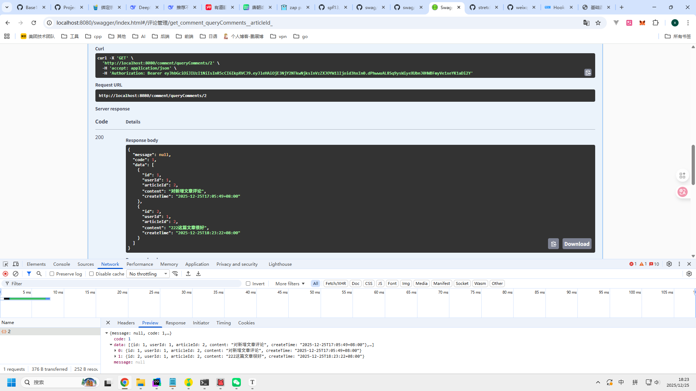

# TODO

- [ ] 打印日志未携带上下文
- [ ] 请求过多时，无法辨别每一次请求，需携带traceID
- [ ] 请求日志插件信息不够详细
- [ ] 自定义gorm logger除Trace方法外未完成
